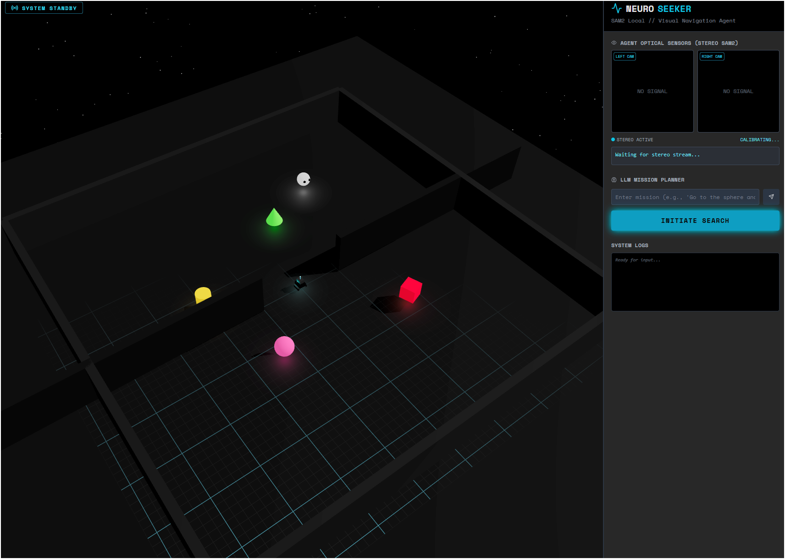

<div align="center">
  
</div>

# SAM2 Agent Simulation

A 3D maze simulation demonstrating an AI agent's navigation using vision and pathfinding algorithms.

## Description

This project simulates an agent equipped with stereo vision cameras navigating a divided maze. The agent uses SAM2 (Segment Anything Model 2) for object detection and implements BFS (Breadth-First Search) pathfinding to cross between maze sections when targets are not found on the current side.

## Features

- **3D Maze Environment**: Divided maze with central wall and door for passage
- **Stereo Vision**: Front and rear camera pairs for depth perception
- **Collision Detection**: Prevents agent from passing through walls
- **Vision-Based Tracking**: Uses SAM2 for target detection and tracking
- **BFS Pathfinding**: Systematic exploration to opposite maze side when target not found
- **Exploration Mode**: Idle behavior for scanning surroundings
- **Direct Navigation**: Agent moves directly towards waypoints during pathfinding
- **Stereo Vision Integrity**: Camera switching removed on collisions to maintain consistent view

## Prerequisites

- Node.js (latest LTS recommended)
- npm or yarn package manager

## Installation

1. Clone the repository:
   ```bash
   git clone <repository-url>
   cd SAM2
   ```

2. Install dependencies:
   ```bash
   npm install
   ```

3. Configure environment variables if required (e.g., API keys for SAM2 integration)

## Running the Simulation

Start the development server:
```bash
npm run dev
```

Open your browser to `http://localhost:3000` (or the provided URL) to view the simulation.

## Project Structure

```
SAM2/
├── components/
│   └── simulation/
│       └── Agent.tsx          # Main agent component with logic
├── types.ts                   # TypeScript definitions
├── package.json               # Dependencies and scripts
└── README.md                  # This file
```

## How It Works

1. **Initial State**: Agent starts scanning surroundings with SCAN action
2. **Target Detection**: When target is visible, agent tracks it with FORWARD/LEFT/RIGHT actions
3. **Scan Accumulation**: Rotation accumulates only during SCAN actions
4. **BFS Activation**: After full 360° scan without finding target, BFS activates
5. **Pathfinding**: Agent navigates to opposite maze side via waypoints through central door
6. **Collision Handling**: Reverses direction on wall collisions without camera switching
7. **Vision Consistency**: Maintains stereo front view during movement and collisions

## Key Behaviors

- **Rotation Tracking**: Only counts during SCAN for proper area coverage
- **Scan Reset**: Resets on target acquisition to prevent premature BFS
- **Maze Navigation**: Hardcoded path through central gap for reliable crossing
- **Speed Adjustment**: Increased velocity during pathfinding for efficiency
- **Debug Logging**: Console outputs for path waypoints and agent state

## Contributing

1. Fork the repository
2. Create a feature branch
3. Make changes with proper testing
4. Submit a pull request

## License

This project is licensed under the MIT License.
